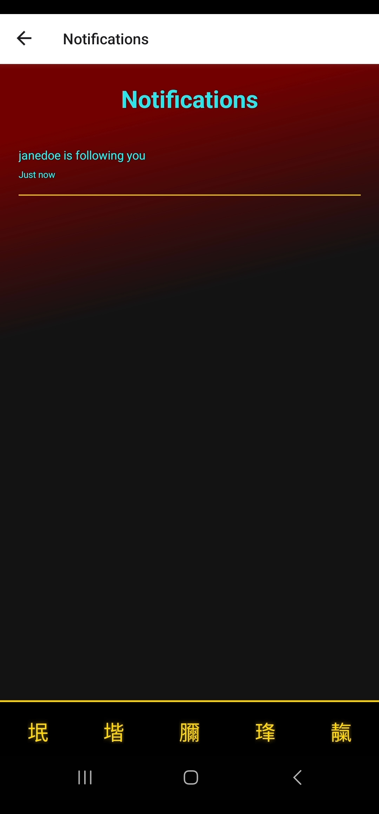
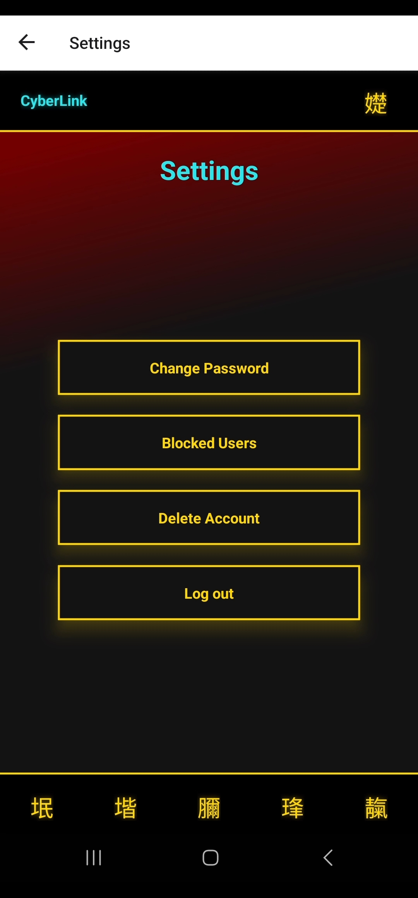

# CyberLink

A cyberpunk-themed mobile social media application built with a vibrant, futuristic design and advanced features for an immersive user experience. This project combines the power of C# .NET for the backend with React Native for a responsive mobile frontend.

## Table of Contents

- [Features](#features)
- [Tech Stack](#tech-stack)
- [Prerequisites](#prerequisites)
- [Configuration](#configuration)
- [Project Structure](#project-structure)
- [Known Issues](#known-issues)
- [Screenshots](#screenshots)

## Features

- **Cyberpunk-inspired UI** with vibrant colors and futuristic elements.
- **Add posts** to your profile and homepage.
- **Stories Feature** at the top of the feed.
- **Real-time Messaging** with WebSocket-based message exchange.
- **Seamless Transitions** between screens.
- **Authentication** with AsyncStorage for session management and tokenisation.

## Tech Stack

### Frontend
- **React Native** - Mobile framework for building the Frontend
- **React Native Icons** - Icons design framework for React Native

### Backend
- **C# .NET** - Backend development
- **WebSockets** - For real-time messaging
- **SQL Server** - Database

## Prerequisites
- [.NET SDK]
- [Node.js & npm]
- [SQL Server]

##Configuration
- **Frontend API Base URL** app/config.js
- **Backend Token** appsettings.json
- **SQL Server Connection String** appsettings.json
- **SMTP Service** Middleware/SMTP.cs

## Project Structure:
.
├── backend
│   ├── Properties
│   │   └── launchsettings.json
│   ├── wwwroot
│   │   └── images
│   ├── Controllers
│   │   ├── AccountController.cs
│   │   ├── CommentController.cs
│   │   ├── FollowerController.cs
│   │   ├── ImageController.cs
│   │   ├── MessageController.cs
│   │   ├── PostController.cs
│   │   ├── StoryController.cs
│   │   ├── UserController.cs
│   │   └── UserPostController.cs
│   ├── Data
│   │   └── ApplicationDbContext.cs
│   ├── Middleware
│   │   ├── ImageService.cs
│   │   ├── SendNotifications.cs
│   │   └── SMTP.cs
│   ├── Models
│   │   ├── Blocked.cs
│   │   ├── Bookmarks.cs
│   │   ├── Comments.cs
│   │   ├── Followers.cs
│   │   ├── Likes.cs
│   │   ├── Messages.cs
│   │   ├── Notifications.cs
│   │   ├── Posts.cs
│   │   ├── Requests.cs
│   │   ├── Stories.cs
│   │   └── Users.cs
│   ├── appsettings.json
│   └── Program.cs
├── frontend
│   ├── app
│   │   ├── colors
│   │   │   └── colors.ts
│   │   ├── components
│   │   │   ├── Background.tsx
│   │   │   ├── HeaderBar.tsx
│   │   │   ├── NavigationBar.tsx
│   │   │   ├── ScreenTitle.tsx
│   │   │   └── SearchBar.tsx
│   │   ├── images
│   │   │   └── default.jpg
│   │   └── views
│   │       ├── BlockedUsersScreen.tsx
│   │       ├── ChangePasswordScreen.tsx
│   │       ├── ChatScreen.tsx
│   │       ├── CreatePostScreen.tsx
│   │       ├── DeleteAccountScreen.tsx
│   │       ├── EditProfileScreen.tsx
│   │       ├── FollowScreen.tsx
│   │       ├── HomeScreen.tsx
│   │       ├── LoginScreen.tsx
│   │       ├── MessagesScreen.tsx
│   │       ├── NotificationsScreen.tsx
│   │       ├── PostScreen.tsx
│   │       ├── ProfileScreen.tsx
│   │       ├── SearchScreen.tsx
│   │       ├── SettingsScreen.tsx
│   │       ├── SignUpScreen.tsx
│   │       └── UserProfileScreen.tsx
│   ├── config.js
│   ├── types.ts
│   ├── app.json
│   └── App.tsx
└── README.md

## Known Issues
- [react native icons] icons do not display properly but instead display in a foreign language
- [C# .NET websockets] unfortunately the websockets do not work as intended even after tutorials and help

##Screenshots

